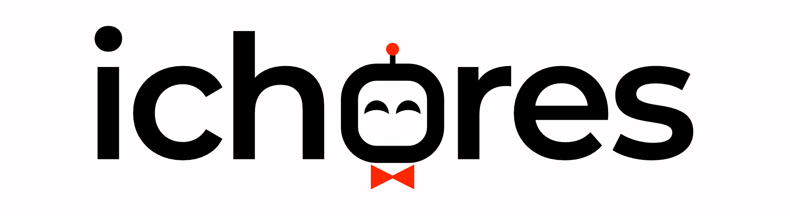

# iChores Pipeline



The pipeline is implemented for the detection and pose estimation of objects from the YCB-V or YCB-iChores datasets.
This repo includes submodules.
Clone this repository via either SSH or HTTPS and clone the submodules as well by:
- `git clone https://github.com/ichores-research/ichores_pipeline.git`
- `cd ichores_pipeline`
- `git submodule init`
- `git submodule update`

## Requirements
- The YOLOv8 and the GDRN++ docker containers need ~35 GB of free disk space.
- A NVIDIA GPU with >16GB is recommended
- System RAM >= 64 GB is recommended

| Module                               | VRAM Usage | System RAM Usage | Disk Space | Description                                 | Link                                                                                   |
|--------------------------------------|------------|------------------|------------|---------------------------------------------|----------------------------------------------------------------------------------------|
| YOLOv8                               | 2.2 GB     | 1.4 GB           | 16.2 GB    | 2D Object Detection with YOLOv8             | [YOLOv8](https://github.com/hoenigpeter/yolov8_ros)                                    |
| GDRN++                               | 3.5 GB     | 7.0 GB           | 18.7 GB    | 6D Object Pose Estimation with GDRN++       | [GDR-Net++](https://github.com/hoenigpeter/gdrnpp_bop2022)                             |
| MediaPipe                            | 0 GB       | 0.3 GB           | 10 GB      | 3D Human Pose Estimation with Pointing Gesture Recognition | [MediaPipe](https://github.com/v4r-tuwien/pointing_gesture_recognition)                                |

## ROS Config
ROS_IP and ROS_MASTER_URI differ from setup to setup.
### Local Machine Debugging
When doing debugging on a local machine with a local ROS master e.g. with https://github.com/hoenigpeter/realsense_ros_docker the ROS_IP and ROS_MASTER_URI are:
- ROS_IP=127.0.0.1
- ROS_MASTER_URI=http://127.0.0.1:11311

### Robot Setup
This is different when the roscore is running on a robot, e.g. HSR:
- ROS_MASTER_URI=http://10.0.0.143:11311
- ROS_IP=10.0.0.232

We will add the ROS setup for Tiago here in the future.

## Configurations
The params for camera intrinsics and rgb/depth-topics and frame ids have to be set in config/params.yaml
Change this according to your project
Currently the resolution must be 640x480

```
im_width  # input image widht
im_height: # input image height
intrinsics:
- [538.391033533567, 0.0, 315.3074696331638]  # camera intrinsics
- [0.0, 538.085452058436, 233.0483557773859]
- [0.0, 0.0, 1.0] 

color_topic: /hsrb/head_rgbd_sensor/rgb/image_rect_color #  rgb image topic
depth_topic: /hsrb/head_rgbd_sensor/depth_registered/image_rect_raw  # depth image topic

color_frame_id: head_rgbd_sensor_rgb_frame  # different for Tiago!
grasp_frame_id: gripper_link  # for Tiago: "gripper_link", for HSR "hand_palm_link"
```

## Startup using the compose file(s)
[Configure](#configurations) all files first. Don't forget to set the [IP Adress of the ROS Master](#ros-master) if you have another ROS-Core running.

The following commands will download the necessary data and then build all the docker containers and start them. 

If the containers were already built before, you can still use the same commands (except download_data.sh) to start the pipeline.

full pipeline:
```
./download_data.sh
cd compose/pipeline
xhost +
```
then for YCB-V dataset objects (ROS example for local setup, adapt ROS_MASTER_URI and ROS_IP depending on your setup):

```
ROS_MASTER_URI=http://127.0.0.1:11311 ROS_IP=127.0.0.1  DATASET=ycbv CONFIG=params_realsense.yaml docker-compose up
```
or for YCB-iChores dataset objects:

```
ROS_MASTER_URI=http://127.0.0.1:11311 ROS_IP=127.0.0.1  DATASET=ycb_ichores CONFIG=params_realsense.yaml docker-compose up
```

for AGH:

```
tiago #this is an alias
set -a
ROS_MASTER_URI=$ROS_MASTER_URI ROS_IP=$ROS_IP DATASET=ycb_ichores CONFIG=params_tiago_cracow.yaml docker-compose up -d
```

Docker containers for yolov8, GDRN++ and MediaPipe will be started.

## Visualization
To visualize the estimated bounding box and object pose use RViZ and load the RViZ config from ./configs
In RViZ visualize the following topics:
- RGB image with bounding box: /pose_estimator/image_with_roi
- Marker of estimated mesh: /gdrnet_meshes
- MarkerArray of estimated grasps: /gdrnet_grasps_vis
- Activate visualization of TFs for 6DoF frame of estimated object pose

## How to use in your own project
The file test_obj_det_dev.py serves as an example that calls all available ROS services.
This pipeline does not publish topics continously but instead supports on demand ROS service calls for less computational overhead.

The following services can be called:
- ```/detect_objects``` of the type [detectron2_service_server.srv](https://github.com/v4r-tuwien/object_detector_msgs/blob/main/srv/detectron2_service_server.srv) 
- ```/estimate_poses``` of the type [estimate_poses.srv](https://github.com/v4r-tuwien/object_detector_msgs/blob/main/srv/estimate_poses.srv)
- ```/detect_pointing_gesture``` of the type [estimate_pointing_gesture.srv](https://github.com/v4r-tuwien/object_detector_msgs/blob/main/srv/estimate_pointing_gesture.srv)

You can directly use the services in your own nodes.

The services are also called in a loop automically in the task container via test_obj_det_dev.py, which is automatically started when `docker compose up` is started.

For grasping, keep in mind that the estimated poses (and therefore the estimated grasps) are currently in the camera frame that was specified.
The grasp vector is annotated based on the gripper_link of Tiago, that means:
The object poses need to be transformed to the base_link / world frame of Tiago.
Those object poses should be given to the transform_grasps function, resulting in a transformation that describes the position and orientation of the gripper_link of Tiago relative to its base_link / world_frame.
The inverse kinematics then solves the transformation of all the joints between gripper_link and base_link / world_frame, after the robot moved to this position, close the gripper fingers -> object is grasped (in theory).

### Main Services

#### detectron2_service_server.srv 
```
sensor_msgs/Image image
---
object_detector_msgs/Detections detections
```

#### estimate_poses.srv
```
Detection det
sensor_msgs/Image rgb
sensor_msgs/Image depth
---
PoseWithConfidence[] poses
```

#### estimate_pointing_gesture.srv
```
sensor_msgs/Image rgb
sensor_msgs/Image depth
---
geometry_msgs/Point shoulder
geometry_msgs/Point elbow
geometry_msgs/Point wrist
```

### Important Messages
#### PoseWithConfidence.msg
```
string name
geometry_msgs/Pose pose
float32 confidence
```

#### Detecions.msg
```
Header header

uint32 height
uint32 width

Detection[] detections
```

#### Detection.msg
```
string name
float32 score
BoundingBox bbox
int64[] mask
```


